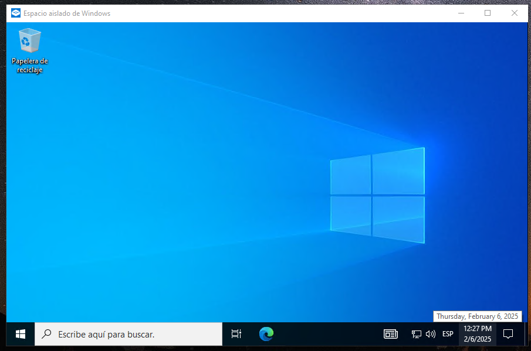

# PPS-Unidad1Actividad4-DAVID

Realiza lo indicado y adjunta las capturas de pantalla o pruebas necesarias para documentar la realización de ellos.

En esta actividad vamos a trabajar sobre la prueba de aplicaciones en entornos controlados: sandboxex o cajas de arena.

Puedes ver en qué consiste y diferentes alternativas en el siguiente artículo:b https://www.hysolate.com/learn/sandboxing/what-is-app-sandboxing/

La actividad consiste en probar la aplicación de la calculadora, que has realizado en una actividad anterior, en un entorno controlado. (Si no la tienes terminada, puedes usar la que tienes adjunta en la tarea).

1. Busca cuáles son las distintas alternativas que tienes para probar esta aplicación en una Sandbox.
2. Crea el entorno controlado y prueba la aplicación en él.

## Alternativas de programas sandbox y haciendo pruebas con un fichero python.

### Windows Sandbox
Para activar el programa Windows Sandbox hace falta activar esta característica de Windows.

- Con las teclas Win + R  buscamos "optionfeatures"

- Dentro seleccionamos la casilla de "Espacio aislado de Windows".

- Abrimos el programa buscando el barra de tareas "Windows Sandbox".

- Se nos abrirá un Windows virtualizado.

Para ejecutar el programa pyhton hay que instalarse todo lo necesario ya que este Windows esta totalmente vacío.

Y así podremos ejecutar programas y hacer pruebas de caja arena para ser antes detectados los fallos o lo que queremas prevenir.

### Sandboxie

Para poseer este programa hace falta descargarlo e instalarlo a traves de este enlace:
https://sandboxie-plus.com/downloads/

Tendremos que seguir los pases del instalador.

Una vez terminado el instalador nos abrirá automáticamente el programa.

Ejecutamos el programa python de la calculadora.

- Tendremos que arrastrar el programa .py hacia el sandboxie

- Nos saldrá esta ventanita y aceptaremos.

- Cuando aceptamos directamente se nos abrirá el programa pero con el aislamiento que queremos tener.

En el programa sandboxie apreciamos los procesos que tiene el programa.

### Firejail

